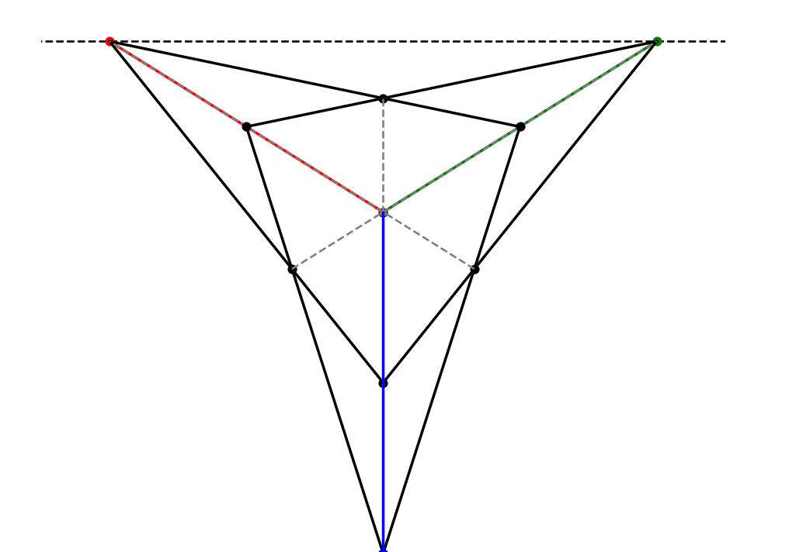
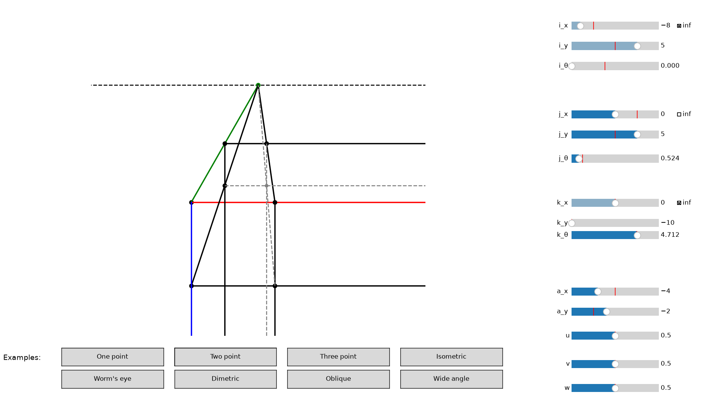

# Perspective by Tad

A simple visual demonstration of one, two, and three point perspective in 2D illustration.



## Download and run

Could run on Python 3.8, but 3.10+ is suggested.

First, clone the repository, then `cd` into the folder.

```
  git clone https://github.com/trdecker/perspective.git
  cd perspective
```

Install the necessary then run with python.

```
  pip install numpy matplotlib
  python perspective.py
```

## Features

- Move each of the three vanishing points individually to stretch and squeeze perspective.
- Select "inf" on a vanishing point to make all lines connected to that point parallel
- Select among eight different examples:
  - One point
  - Two point
  - Three point
  - Isometric
  - Worm's eye
  - Dimetric
  - Oblique
  - Wide angle

## How to use



Vanishing points:
- i (red)
- j (blue)
- k (green)

Each vanishing points has an x, y, and theta (rotation) slider, as well as an "inf" checkbox.
- Checking "inf" makes the dot "infinitely" far away, so that all lines connected to the vanishing point become symmetrical.
- X and y are disabled when "inf" is checked.
- Theta is only used when "inf" is checked, and is used to set the angle of the parallel lines.

"a" is the main dot the vanishing points are connected to; it is our "focus".
- A can be moved in the x and y cartesian directions with the a_x and a_y sliders.

u, v, and w are the "connecting" dots. They set how thick/thin the cuboid is.
  - u is on the red line connecting a to i.
  - v is on the green line connecting a to j.
  - w is on the blue line connecting a to k.

The rest of the dots are created automatically from the above mentioned dots and lines.

Select any of the eight examples to set the dots values to the given preset example.

## Future work

- Toggleable culling. Hide/gray out:
  - Edges on the "back of the cube"
  - "Construction" edges
  - Vanishing point lines not part of the cube
- Click and drag points
- Text inputs for point location
- Non-cuboid 3D shapes (pyramid? sphere?)